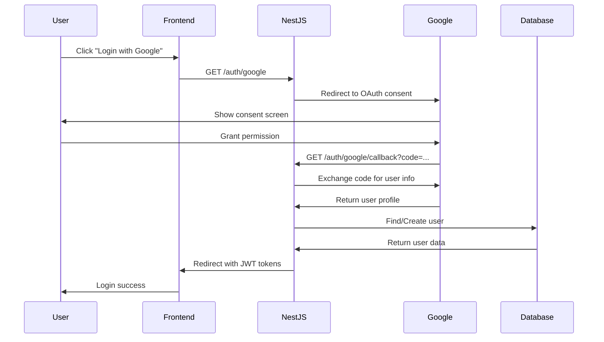

# 🔐 Google OAuth Integration

Dự án đã được tích hợp thành công tính năng **Google OAuth** cho phép người dùng đăng nhập bằng tài khoản Google.

## 🚀 Tính năng đã implement

### ✅ **Authentication System**

- **Traditional login**: Email/Password với JWT tokens
- **Google OAuth**: Login với tài khoản Google
- **Account linking**: Tự động liên kết Google với tài khoản hiện có
- **Auto registration**: Tự động tạo tài khoản mới từ Google profile

### ✅ **Database Schema**

- Thêm field `googleId` (String, unique) vào model User
- Thêm field `avatar` để lưu Google profile picture
- Field `password` đã được chuyển thành optional cho Google users

### ✅ **API Endpoints**

#### **GET /auth/google**

Khởi tạo Google OAuth flow

```bash
curl -X GET http://localhost:3000/auth/google
# Redirect người dùng đến Google OAuth
```

#### **GET /auth/google/callback**

Xử lý callback từ Google

```bash
# Google sẽ redirect về:
# http://localhost:3000/auth/google/callback?code=...
# Server sẽ redirect đến frontend với tokens
```

#### **POST /auth/google/verify** (Placeholder)

Endpoint dành cho mobile apps (chưa implement)

```bash
# Sẽ được implement với google-auth-library
```

### ✅ **Authentication Flow**



## ⚙️ Cấu hình

### **1. Google Cloud Console**

1. Truy cập [Google Cloud Console](https://console.cloud.google.com/)
2. Tạo project mới hoặc chọn project hiện có
3. Enable Google+ API
4. Tạo OAuth 2.0 credentials:
   - **Application type**: Web application
   - **Authorized JavaScript origins**: `http://localhost:3000`
   - **Authorized redirect URIs**: `http://localhost:3000/auth/google/callback`

### **2. Environment Variables**

Thêm vào file `.env`:

```env
# Google OAuth
GOOGLE_CLIENT_ID="your-google-client-id.googleusercontent.com"
GOOGLE_CLIENT_SECRET="your-google-client-secret"
GOOGLE_CALLBACK_URL="http://localhost:3000/auth/google/callback"

# Frontend URL for redirects
FRONTEND_URL="http://localhost:3000"
```

### **3. Database Migration**

Database đã được cập nhật với schema mới:

```sql
-- User table now includes:
googleId    String?    @unique
password    String?    -- Made optional for Google users
avatar      String?    -- For Google profile pictures
```

## 🏗️ Kiến trúc Implementation

### **Google Strategy**

```typescript
// src/auth/strategies/google.strategy.ts
@Injectable()
export class GoogleStrategy extends PassportStrategy(Strategy, 'google') {
  // Xử lý validation từ Google OAuth response
  async validate(
    accessToken: string,
    refreshToken: string,
    profile: GoogleProfile,
  ) {
    // Transform Google profile thành user data
    return this.authService.googleLogin(userPayload);
  }
}
```

### **Auth Service**

```typescript
// src/auth/auth.service.ts
async googleLogin(googleUser: GoogleUserPayload) {
  // 1. Tìm user bằng Google ID
  // 2. Nếu không có, tìm bằng email để link account
  // 3. Nếu vẫn không có, tạo user mới
  // 4. Generate JWT tokens
  // 5. Return user data + tokens
}
```

### **User Repository**

```typescript
// src/users/repositories/user.repository.ts
async findByGoogleId(googleId: string): Promise<UserWithRelations | null>
async linkGoogleAccount(userId: number, googleId: string, avatar?: string): Promise<User>
async createGoogleUser(data: GoogleUserData): Promise<UserWithRelations>
```

## 🧪 Testing

### **Manual Testing**

1. Start development server:

```bash
pnpm run start:dev
```

2. Navigate to: `http://localhost:3000/auth/google`

3. Complete Google OAuth flow

4. Check database for new/updated user record

### **Account Scenarios**

- **New Google user**: Tự động tạo account mới
- **Existing email**: Link Google ID với account hiện có
- **Existing Google user**: Login bình thường
- **Blocked account**: Reject login với error message

## 🔧 Production Deployment

### **Environment Updates**

```env
# Production URLs
GOOGLE_CALLBACK_URL="https://yourdomain.com/auth/google/callback"
FRONTEND_URL="https://yourdomain.com"
CORS_ORIGIN="https://yourdomain.com"
```

### **Google Cloud Console**

- Update Authorized origins: `https://yourdomain.com`
- Update Redirect URIs: `https://yourdomain.com/auth/google/callback`
- Verify domain ownership

### **Security Considerations**

- ✅ JWT tokens có expiration time
- ✅ Refresh token rotation
- ✅ Google ID validation
- ✅ Account status checking
- ✅ Error handling và logging

## 📝 Next Steps

### **Mobile App Support**

Implement `/auth/google/verify` endpoint:

```bash
pnpm add google-auth-library
```

### **Additional OAuth Providers**

- Facebook OAuth
- GitHub OAuth
- Apple Sign In

### **Enhanced Security**

- PKCE for OAuth flow
- State parameter validation
- Rate limiting cho OAuth endpoints

## 🐛 Troubleshooting

### **Common Issues**

1. **"redirect_uri_mismatch"**
   - Check Google Cloud Console redirect URIs
   - Ensure exact match với `GOOGLE_CALLBACK_URL`

2. **"invalid_client"**
   - Verify `GOOGLE_CLIENT_ID` và `GOOGLE_CLIENT_SECRET`
   - Check Google Cloud Console credentials

3. **Database errors**
   - Run `npx prisma db push` để sync schema
   - Check `googleId` field constraints

4. **Frontend redirect issues**
   - Verify `FRONTEND_URL` environment variable
   - Check frontend route handling

### **Debug Commands**

```bash
# Check environment variables
npm run start:dev | grep GOOGLE

# Check database schema
npx prisma studio

# View logs
tail -f logs/app.log
```

---

🎉 **Google OAuth integration hoàn tất!** Người dùng giờ có thể đăng nhập bằng tài khoản Google một cách an toàn và tiện lợi.
