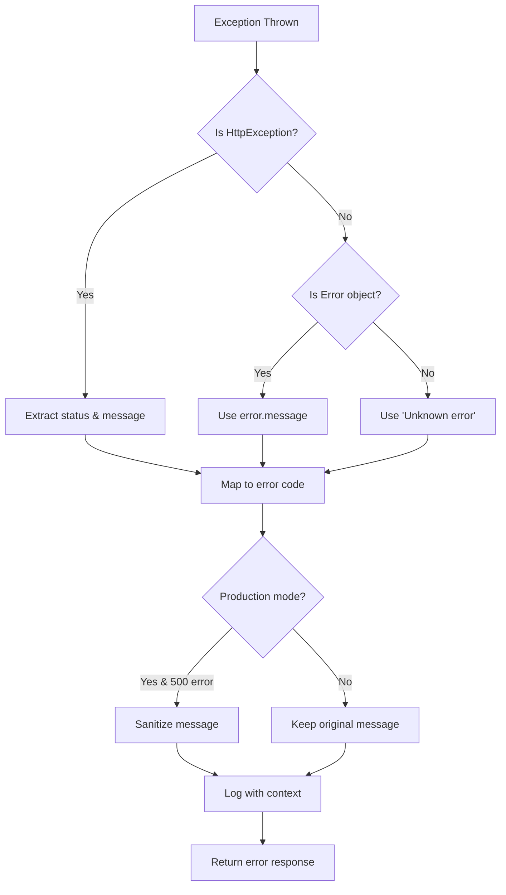

# Global Exception Filter

## 📋 Tổng quan

`GlobalExceptionFilter` là catch-all exception filter xử lý tất cả exceptions không được handle bởi các specific filters khác. Đây là filter cuối cùng trong chain và đảm bảo không có exception nào unhandled.

## 📁 File location

```
src/shared/filters/global-exception.filter.ts
```

## 🎯 Chức năng

### 1. **Catch All Exceptions**

```typescript
@Catch()  // Không specify exception type = catch tất cả
export class GlobalExceptionFilter implements ExceptionFilter
```

### 2. **Handle HTTP Exceptions**

- `BadRequestException`, `NotFoundException`, `UnauthorizedException`, etc.
- Extract proper status code và message
- Map exception types thành error codes

### 3. **Handle Unknown Exceptions**

- JavaScript Error objects
- Unexpected runtime exceptions
- Fallback cho untyped errors

### 4. **Production Security**

```typescript
// Sanitize error message for production
if (
  process.env.NODE_ENV === 'production' &&
  status === HttpStatus.INTERNAL_SERVER_ERROR
) {
  message = 'Internal server error';
}
```

## 🏗️ Error Response Structure

```typescript
interface ErrorResponse {
  success: false;
  error: {
    code: string; // Semantic error code
    message: string | string[]; // User-friendly message
    timestamp: string; // ISO datetime
    path: string; // Request path
    statusCode: number; // HTTP status code
  };
}
```

## 📊 Error Code Mapping

| HTTP Status | Exception Type                 | Error Code            |
| ----------- | ------------------------------ | --------------------- |
| 400         | `BadRequestException`          | `BAD_REQUEST`         |
| 401         | `UnauthorizedException`        | `UNAUTHORIZED`        |
| 403         | `ForbiddenException`           | `FORBIDDEN`           |
| 404         | `NotFoundException`            | `NOT_FOUND`           |
| 409         | `ConflictException`            | `CONFLICT`            |
| 422         | `UnprocessableEntityException` | `VALIDATION_ERROR`    |
| 429         | `ThrottlerException`           | `RATE_LIMIT_EXCEEDED` |
| 500         | `InternalServerErrorException` | `INTERNAL_ERROR`      |

## 📝 Logging

### Request Context Logging

```typescript
this.logger.error(
  `Exception caught: ${request.method} ${request.url} - Status: ${status}`,
  {
    exception: exception.stack,
    request: {
      method: request.method,
      url: request.url,
      headers: request.headers,
      body: request.body,
      query: request.query,
      params: request.params,
      ip: request.ip,
      userAgent: request.get('User-Agent'),
    },
    timestamp: new Date().toISOString(),
  },
);
```

### Log Output Example

```
[GlobalExceptionFilter] Exception caught: POST /api/auth/register - Status: 409 - Message: "Email user@example.com đã được sử dụng"
```

## 🔄 Processing Flow



## 🛠️ Usage Examples

### HTTP Exception

```typescript
// In service
throw new BadRequestException('Invalid email format');

// Response
{
  "success": false,
  "error": {
    "code": "BAD_REQUEST",
    "message": "Invalid email format",
    "timestamp": "2024-01-01T10:00:00.000Z",
    "path": "/api/users",
    "statusCode": 400
  }
}
```

### Custom Business Exception

```typescript
// In service
throw UserException.emailAlreadyExists('user@example.com');

// Response
{
  "success": false,
  "error": {
    "code": "EMAIL_ALREADY_EXISTS",
    "message": "Email user@example.com đã được sử dụng",
    "timestamp": "2024-01-01T10:00:00.000Z",
    "path": "/api/auth/register",
    "statusCode": 409
  }
}
```

### Validation Error (from ValidationPipe)

```typescript
// Automatic handling of class-validator errors
{
  "success": false,
  "error": {
    "code": "VALIDATION_ERROR",
    "message": [
      "email must be a valid email",
      "password must be longer than 6 characters"
    ],
    "timestamp": "2024-01-01T10:00:00.000Z",
    "path": "/api/auth/register",
    "statusCode": 422
  }
}
```

## ⚡ Performance

- **Minimal overhead**: Chỉ chạy khi có exception
- **Fast path**: HTTP exceptions được process nhanh
- **Structured logging**: Dễ search và analyze logs
- **Memory efficient**: Không cache hay store state

## 🔧 Configuration

### Register trong main.ts

```typescript
app.useGlobalFilters(
  new PrismaExceptionFilter(), // Specific filters first
  new GlobalExceptionFilter(), // Global filter last
);
```

### Environment-based behavior

```typescript
// Development: Show detailed errors
// Production: Sanitize internal server errors
const isDevelopment = process.env.NODE_ENV !== 'production';
```

## 🧪 Testing

### Unit Test Example

```typescript
describe('GlobalExceptionFilter', () => {
  it('should handle BadRequestException', () => {
    const filter = new GlobalExceptionFilter();
    const exception = new BadRequestException('Test error');

    filter.catch(exception, mockArgumentsHost);

    expect(mockResponse.status).toHaveBeenCalledWith(400);
    expect(mockResponse.json).toHaveBeenCalledWith({
      success: false,
      error: {
        code: 'BAD_REQUEST',
        message: 'Test error',
        statusCode: 400,
        // ... other fields
      },
    });
  });
});
```

## 🚨 Best Practices

### ✅ Do

- Keep as catch-all filter (last in chain)
- Log với sufficient context cho debugging
- Sanitize error messages trong production
- Use semantic error codes

### ❌ Don't

- Register before specific filters
- Log sensitive data (passwords, tokens)
- Throw exceptions inside filter
- Modify request/response objects unnecessarily

## 🔍 Troubleshooting

### Common Issues

1. **Filter not catching exceptions**
   - Check filter registration order trong main.ts
   - Ensure no specific filter already handled exception

2. **Missing request context trong logs**
   - Verify HTTP context available
   - Check exception origin (HTTP vs internal)

3. **Inconsistent error format**
   - Verify ErrorResponse interface usage
   - Check response transformation logic

### Debug Tips

```typescript
// Add debug logging
this.logger.debug(`Processing exception: ${exception.constructor.name}`);
```
