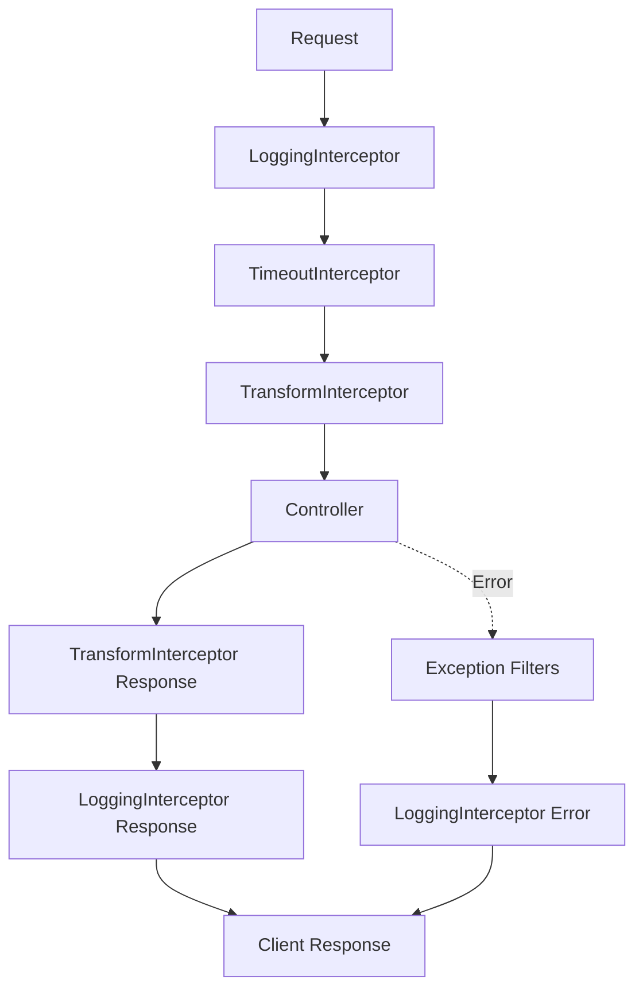

# Logging và Interceptors

## 📋 Tổng quan

Hệ thống logging và interceptors cung cấp comprehensive request/response tracking, error logging, và response transformation để đảm bảo consistent API experience.

## 📁 File locations

```
src/shared/interceptor/logging.interceptor.ts      # Request/Error logging
src/shared/interceptor/transform.interceptor.ts   # Response transformation
src/shared/interceptor/timeout.interceptor.ts     # Request timeout handling
```

## 🔍 Enhanced Logging Interceptor

### Overview

`LoggingInterceptor` tracks tất cả HTTP requests, logging cả successful responses và errors với detailed context.

### Features

- **Request Start Logging**: Log khi request bắt đầu
- **Success Response Logging**: Log với status code và response time
- **Error Logging**: Detailed error logs với stack trace và request context
- **Performance Monitoring**: Response time tracking
- **Request Context**: Full request information trong error logs

### Implementation

```typescript
@Injectable()
export class LoggingInterceptor implements NestInterceptor {
  private readonly logger = new Logger(LoggingInterceptor.name);

  intercept(context: ExecutionContext, next: CallHandler): Observable<any> {
    const request = context.switchToHttp().getRequest<Request>();
    const response = context.switchToHttp().getResponse<Response>();
    const { method, url, headers } = request;
    const ip = request.ip;
    const userAgent = headers['user-agent'] || '';

    const now = Date.now();

    this.logger.log(`${method} ${url} - ${ip} - ${userAgent} - Start`);

    return next.handle().pipe(
      tap(() => {
        const responseTime = Date.now() - now;
        const statusCode = response.statusCode;
        this.logger.log(
          `${method} ${url} - ${ip} - ${userAgent} - ${statusCode} - ${responseTime}ms - SUCCESS`,
        );
      }),
      catchError((error) => {
        const responseTime = Date.now() - now;
        const statusCode = error.status || 500;

        this.logger.error(
          `${method} ${url} - ${ip} - ${userAgent} - ${statusCode} - ${responseTime}ms - ERROR: ${error.message}`,
          {
            error: error.stack || error,
            requestBody: request.body,
            requestQuery: request.query,
            requestParams: request.params,
            timestamp: new Date().toISOString(),
          },
        );

        return throwError(() => error);
      }),
    );
  }
}
```

### Log Examples

#### Success Request

```
[LoggingInterceptor] GET /api/users/1 - 127.0.0.1 - Mozilla/5.0 Chrome/91.0 - Start
[LoggingInterceptor] GET /api/users/1 - 127.0.0.1 - Mozilla/5.0 Chrome/91.0 - 200 - 45ms - SUCCESS
```

#### Failed Request

```
[LoggingInterceptor] POST /api/auth/register - 127.0.0.1 - Mozilla/5.0 Chrome/91.0 - Start
[LoggingInterceptor] POST /api/auth/register - 127.0.0.1 - Mozilla/5.0 Chrome/91.0 - 409 - 123ms - ERROR: Email user@example.com đã được sử dụng
{
  error: "BusinessException: Email user@example.com đã được sử dụng\n    at UserException.emailAlreadyExists...",
  requestBody: { email: "user@example.com", name: "John Doe", ... },
  requestQuery: {},
  requestParams: {},
  timestamp: "2024-01-01T10:00:00.000Z"
}
```

### Performance Monitoring

- **Response Time Tracking**: Millisecond precision
- **Request Volume**: Count requests per endpoint
- **Error Rate**: Track error frequency
- **Slow Query Detection**: Identify performance bottlenecks

## 🔄 Transform Interceptor

### Overview

`TransformInterceptor` standardizes tất cả successful API responses với consistent format.

### Features

- **Consistent Response Structure**: Standardized success format
- **Automatic Metadata**: Inject timestamp và path
- **Message Handling**: Extract và preserve response messages
- **Data Extraction**: Handle nested response structures

### Response Format

```typescript
interface SuccessResponse<T> {
  success: true;
  data: T;
  message?: string;
  timestamp: string;
  path: string;
}
```

### Implementation

```typescript
@Injectable()
export class TransformInterceptor<T>
  implements NestInterceptor<T, SuccessResponse<T>>
{
  intercept(
    context: ExecutionContext,
    next: CallHandler,
  ): Observable<SuccessResponse<T>> {
    const request = context.switchToHttp().getRequest<Request>();

    return next.handle().pipe(
      map((data: T) => {
        // Handle cases where data already has a message
        let message: string | undefined;
        let responseData: T = data;

        if (data && typeof data === 'object' && 'message' in data) {
          message = (data as any).message;

          // If response only contains message, keep whole object
          if (Object.keys(data).length === 1 && 'message' in data) {
            responseData = data;
          } else if ('data' in data) {
            // Extract data portion if exists
            responseData = (data as any).data;
          }
        }

        return {
          success: true,
          data: responseData,
          message,
          timestamp: new Date().toISOString(),
          path: request.url,
        };
      }),
    );
  }
}
```

### Transformation Examples

#### Simple Data Response

```typescript
// Controller returns
return { id: 1, name: 'John Doe' };

// TransformInterceptor output
{
  "success": true,
  "data": { "id": 1, "name": "John Doe" },
  "timestamp": "2024-01-01T10:00:00.000Z",
  "path": "/api/users/1"
}
```

#### Response with Message

```typescript
// Controller returns
return { message: 'Đăng ký thành công. Vui lòng kiểm tra email.' };

// TransformInterceptor output
{
  "success": true,
  "data": { "message": "Đăng ký thành công. Vui lòng kiểm tra email." },
  "message": "Đăng ký thành công. Vui lòng kiểm tra email.",
  "timestamp": "2024-01-01T10:00:00.000Z",
  "path": "/api/auth/register"
}
```

#### Complex Response

```typescript
// Controller returns
return {
  data: { user: { id: 1, email: 'user@example.com' } },
  message: 'User created successfully'
};

// TransformInterceptor output
{
  "success": true,
  "data": { "user": { "id": 1, "email": "user@example.com" } },
  "message": "User created successfully",
  "timestamp": "2024-01-01T10:00:00.000Z",
  "path": "/api/users"
}
```

## ⏱️ Timeout Interceptor

### Overview

`TimeoutInterceptor` prevents requests từ hanging indefinitely bằng cách set timeout limit.

### Features

- **Configurable Timeout**: Set via environment variable
- **Graceful Handling**: Convert TimeoutError thành RequestTimeoutException
- **Preserve Other Errors**: Only handle timeout-specific errors

### Implementation

```typescript
@Injectable()
export class TimeoutInterceptor implements NestInterceptor {
  private readonly timeoutMs = serverConfig.timeoutMs;

  intercept(context: ExecutionContext, next: CallHandler): Observable<unknown> {
    return next.handle().pipe(
      timeout(this.timeoutMs),
      catchError((err) => {
        if (err instanceof TimeoutError) {
          return throwError(() => new RequestTimeoutException());
        }
        return throwError(() => err as Error);
      }),
    );
  }
}
```

### Configuration

```typescript
// .env
TIMEOUT_MS=5000  # 5 seconds

// config.ts
TIMEOUT_MS: z.coerce.number().int().positive().default(5000),
```

## 📊 Interceptor Execution Order

### Registration trong main.ts

```typescript
app.useGlobalInterceptors(new LoggingInterceptor());
```

### Execution Flow

```
1. LoggingInterceptor    - Start logging
2. TimeoutInterceptor    - Set timeout
3. TransformInterceptor  - Transform response
4. Controller Method     - Business logic
5. TransformInterceptor  - Format success response
6. LoggingInterceptor    - Log success/error
```

### Interceptor Stack



## 🔧 Configuration

### Global Registration (SharedModule)

```typescript
@Module({
  providers: [
    LoggingInterceptor,
    TransformInterceptor,
    TimeoutInterceptor,
    {
      provide: APP_INTERCEPTOR,
      useClass: LoggingInterceptor,
    },
    {
      provide: APP_INTERCEPTOR,
      useClass: TransformInterceptor,
    },
    {
      provide: APP_INTERCEPTOR,
      useClass: TimeoutInterceptor,
    },
  ],
  exports: [TransformInterceptor, LoggingInterceptor, TimeoutInterceptor],
})
export class SharedModule {}
```

### Manual Registration (main.ts)

```typescript
app.useGlobalInterceptors(new LoggingInterceptor());
```

## 📈 Performance Impact

### LoggingInterceptor

- **Minimal Overhead**: ~1-2ms per request
- **Memory Usage**: Temporary log objects
- **I/O Impact**: Console/file logging operations

### TransformInterceptor

- **Negligible Overhead**: Simple object transformation
- **Memory**: Additional response wrapper object
- **CPU**: Minimal JSON operations

### TimeoutInterceptor

- **No Overhead**: Only activates on timeout
- **Memory**: Timeout timer per request
- **Cancellation**: Proper cleanup của hanging requests

## 🧪 Testing Interceptors

### Unit Testing LoggingInterceptor

```typescript
describe('LoggingInterceptor', () => {
  let interceptor: LoggingInterceptor;
  let mockExecutionContext: ExecutionContext;
  let mockCallHandler: CallHandler;

  beforeEach(() => {
    interceptor = new LoggingInterceptor();
    // Setup mocks...
  });

  it('should log successful requests', (done) => {
    jest.spyOn(interceptor['logger'], 'log');

    const mockResponse = of('test data');
    mockCallHandler.handle.mockReturnValue(mockResponse);

    interceptor
      .intercept(mockExecutionContext, mockCallHandler)
      .subscribe(() => {
        expect(interceptor['logger'].log).toHaveBeenCalledWith(
          expect.stringContaining('SUCCESS'),
        );
        done();
      });
  });

  it('should log errors', (done) => {
    jest.spyOn(interceptor['logger'], 'error');

    const mockError = new Error('Test error');
    mockCallHandler.handle.mockReturnValue(throwError(() => mockError));

    interceptor.intercept(mockExecutionContext, mockCallHandler).subscribe({
      error: () => {
        expect(interceptor['logger'].error).toHaveBeenCalledWith(
          expect.stringContaining('ERROR: Test error'),
          expect.any(Object),
        );
        done();
      },
    });
  });
});
```

### Integration Testing

```typescript
describe('API Response Format', () => {
  it('should have consistent success format', async () => {
    const response = await request(app.getHttpServer())
      .get('/api/users/1')
      .expect(200);

    expect(response.body).toMatchObject({
      success: true,
      data: expect.any(Object),
      timestamp: expect.any(String),
      path: '/api/users/1',
    });
  });

  it('should include error context trong logs', async () => {
    const logSpy = jest.spyOn(console, 'error');

    await request(app.getHttpServer())
      .post('/api/auth/register')
      .send({ invalid: 'data' })
      .expect(400);

    expect(logSpy).toHaveBeenCalledWith(
      expect.stringContaining('ERROR:'),
      expect.objectContaining({
        requestBody: { invalid: 'data' },
        timestamp: expect.any(String),
      }),
    );
  });
});
```

## 🚨 Best Practices

### ✅ Do

- Use structured logging để easy parsing
- Include sufficient context trong error logs
- Monitor response times để performance tuning
- Set appropriate timeout values
- Keep interceptor logic lightweight

### ❌ Don't

- Log sensitive data (passwords, tokens, personal info)
- Perform heavy operations trong interceptors
- Throw exceptions từ logging interceptor
- Log excessive amounts of data
- Forget to handle errors properly

## 🔍 Troubleshooting

### Common Issues

#### 1. **Interceptor Not Executing**

```typescript
// Check registration trong main.ts or shared module
app.useGlobalInterceptors(new LoggingInterceptor());

// Or verify SharedModule import trong AppModule
```

#### 2. **Missing Logs**

```typescript
// Verify logger configuration
private readonly logger = new Logger(LoggingInterceptor.name);

// Check log level settings
```

#### 3. **Response Format Issues**

```typescript
// Ensure TransformInterceptor registered correctly
// Check if controller returns proper data structure
```

#### 4. **Request Timeouts**

```typescript
// Adjust timeout setting trong config
TIMEOUT_MS=10000  # Increase to 10 seconds

// Check for blocking operations trong controllers
```

### Debug Tips

```typescript
// Add debug logging trong interceptors
this.logger.debug(
  `Interceptor executing: ${context.getClass().name}.${context.getHandler().name}`,
);

// Monitor interceptor execution order
console.log('Interceptor stack:', context.getType());
```

## 📊 Monitoring và Metrics

### Key Metrics to Track

- **Average Response Time**: Per endpoint
- **Error Rate**: Percentage of failed requests
- **Request Volume**: Requests per minute/hour
- **Timeout Frequency**: How often requests timeout
- **Error Types**: Most common error categories

### Log Analysis

```bash
# Find slow requests
grep "SUCCESS" logs.txt | awk '$9 > 1000' # > 1 second

# Count error types
grep "ERROR:" logs.txt | awk '{print $8}' | sort | uniq -c

# Monitor request volume
grep "Start" logs.txt | awk '{print $1 " " $2}' | uniq -c
```
