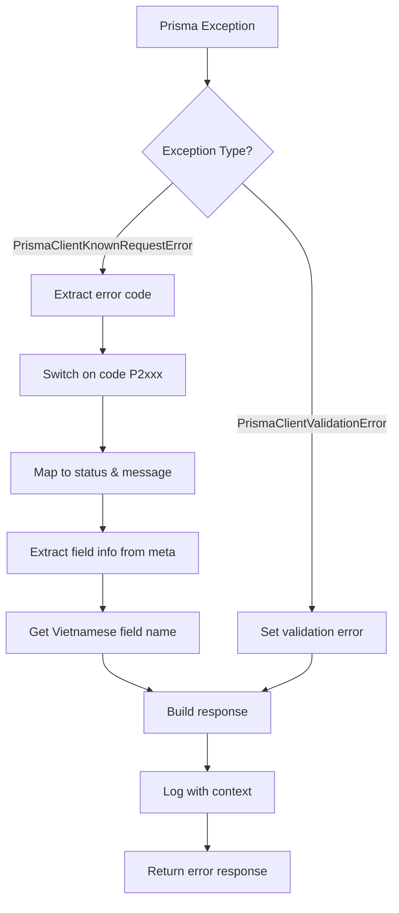

# Prisma Exception Filter

## 📋 Tổng quan

`PrismaExceptionFilter` xử lý các exceptions specific từ Prisma ORM, chuyển đổi database error codes thành user-friendly messages bằng tiếng Việt với proper HTTP status codes.

## 📁 File location

```
src/shared/filters/prisma-exception.filter.ts
```

## 🎯 Supported Exception Types

```typescript
@Catch(PrismaClientKnownRequestError, PrismaClientValidationError)
```

### 1. **PrismaClientKnownRequestError**

- Database constraint violations
- Record not found errors
- Foreign key violations
- Unique constraint violations

### 2. **PrismaClientValidationError**

- Invalid query structure
- Type validation errors
- Schema validation failures

## 📊 Error Code Mapping

### Most Common Errors

| Prisma Code | HTTP Status | Error Code                         | Vietnamese Message                             |
| ----------- | ----------- | ---------------------------------- | ---------------------------------------------- |
| `P2002`     | 409         | `UNIQUE_CONSTRAINT_VIOLATION`      | `{Field} đã tồn tại`                           |
| `P2025`     | 404         | `RECORD_NOT_FOUND_FOR_OPERATION`   | `Không tìm thấy bản ghi để thực hiện thao tác` |
| `P2003`     | 400         | `FOREIGN_KEY_CONSTRAINT_VIOLATION` | `Dữ liệu tham chiếu không hợp lệ`              |
| `P2001`     | 404         | `RECORD_NOT_FOUND`                 | `Bản ghi không tồn tại`                        |
| `P2011`     | 400         | `NULL_CONSTRAINT_VIOLATION`        | `Ràng buộc null bị vi phạm`                    |

### Complete Error Mapping

<details>
<summary>View all supported Prisma error codes</summary>

| Code  | Status | Message                                      | Description                      |
| ----- | ------ | -------------------------------------------- | -------------------------------- |
| P2000 | 400    | Giá trị quá dài cho trường dữ liệu           | Value too long                   |
| P2001 | 404    | Bản ghi không tồn tại                        | Record not found                 |
| P2002 | 409    | {Field} đã tồn tại                           | Unique constraint violation      |
| P2003 | 400    | Dữ liệu tham chiếu không hợp lệ              | Foreign key constraint violation |
| P2004 | 400    | Ràng buộc dữ liệu bị vi phạm                 | Constraint violation             |
| P2005 | 400    | Giá trị không hợp lệ cho trường dữ liệu      | Invalid value                    |
| P2007 | 400    | Lỗi xác thực dữ liệu                         | Data validation error            |
| P2011 | 400    | Ràng buộc null bị vi phạm                    | Null constraint violation        |
| P2012 | 400    | Thiếu giá trị bắt buộc                       | Missing required value           |
| P2014 | 400    | Thay đổi dữ liệu vi phạm quan hệ bắt buộc    | Required relation violation      |
| P2015 | 404    | Bản ghi liên quan không tìm thấy             | Related record not found         |
| P2025 | 404    | Không tìm thấy bản ghi để thực hiện thao tác | Record not found for operation   |

</details>

## 🏗️ Field Name Mapping

```typescript
private getFieldDisplayName(field: string): string {
  const fieldMap: Record<string, string> = {
    email: 'Email',
    username: 'Tên người dùng',
    phone: 'Số điện thoại',
    phoneNumber: 'Số điện thoại',
    name: 'Tên',
    title: 'Tiêu đề',
    code: 'Mã',
    slug: 'Đường dẫn',
  };

  return fieldMap[field] || 'Trường dữ liệu';
}
```

## 📝 Response Examples

### Unique Constraint Violation (P2002)

```typescript
// Prisma error
PrismaClientKnownRequestError: Unique constraint failed on the fields: (`email`)

// Response
{
  "success": false,
  "error": {
    "code": "UNIQUE_CONSTRAINT_VIOLATION",
    "message": "Email đã tồn tại",
    "timestamp": "2024-01-01T10:00:00.000Z",
    "path": "/api/users",
    "statusCode": 409
  }
}
```

### Record Not Found (P2025)

```typescript
// Prisma error
PrismaClientKnownRequestError: An operation failed because it depends on one or more records that were required but not found.

// Response
{
  "success": false,
  "error": {
    "code": "RECORD_NOT_FOUND_FOR_OPERATION",
    "message": "Không tìm thấy bản ghi để thực hiện thao tác",
    "timestamp": "2024-01-01T10:00:00.000Z",
    "path": "/api/users/999",
    "statusCode": 404
  }
}
```

### Foreign Key Violation (P2003)

```typescript
// Prisma error
PrismaClientKnownRequestError: Foreign key constraint failed on the field: `roleId`

// Response
{
  "success": false,
  "error": {
    "code": "FOREIGN_KEY_CONSTRAINT_VIOLATION",
    "message": "Dữ liệu tham chiếu không hợp lệ",
    "timestamp": "2024-01-01T10:00:00.000Z",
    "path": "/api/users",
    "statusCode": 400
  }
}
```

## 📋 Logging

### Detailed Error Context

```typescript
this.logger.error(
  `Prisma Exception: ${request.method} ${request.url} - Code: ${exception.code} - Message: ${message}`,
  {
    exception: exception.stack,
    prismaCode: exception.code,
    meta: exception.meta, // Prisma metadata (affected fields, etc.)
    request: {
      method: request.method,
      url: request.url,
      ip: request.ip,
      userAgent: request.get('User-Agent'),
    },
    timestamp: new Date().toISOString(),
  },
);
```

### Log Output Example

```
[PrismaExceptionFilter] Prisma Exception: POST /api/users - Code: P2002 - Message: Email đã tồn tại
{
  exception: "PrismaClientKnownRequestError: Unique constraint failed...",
  prismaCode: "P2002",
  meta: { target: ["email"] },
  request: { method: "POST", url: "/api/users", ... }
}
```

## 🔄 Processing Flow



## 🛠️ Usage trong Services

### Creating User với Duplicate Email

```typescript
// users.service.ts
async createUser(userData: CreateUserDto) {
  try {
    return await this.prisma.user.create({
      data: userData
    });
  } catch (error) {
    // PrismaExceptionFilter sẽ tự động handle P2002 error
    throw error;
  }
}

// Automatic response:
// 409 Conflict: "Email đã tồn tại"
```

### Updating Non-existent Record

```typescript
// products.service.ts
async updateProduct(id: number, data: UpdateProductDto) {
  try {
    return await this.prisma.product.update({
      where: { id },
      data
    });
  } catch (error) {
    // PrismaExceptionFilter sẽ handle P2025 error
    throw error;
  }
}

// Automatic response:
// 404 Not Found: "Không tìm thấy bản ghi để thực hiện thao tác"
```

## ⚡ Performance

### Fast Error Mapping

- **O(1) lookup** cho error codes với switch statement
- **Minimal processing** cho field name mapping
- **No database queries** trong error handling

### Memory Efficiency

- **Stateless filter** - không store data
- **Lazy field mapping** - chỉ process khi cần
- **Reusable instances** - singleton pattern

## 🔧 Configuration

### Registration Order (Important!)

```typescript
// main.ts - PrismaExceptionFilter PHẢI đứng trước GlobalExceptionFilter
app.useGlobalFilters(
  new PrismaExceptionFilter(), // ← Handles Prisma errors specifically
  new GlobalExceptionFilter(), // ← Catches remaining errors
);
```

### Field Name Customization

```typescript
// Extend field mapping cho custom fields
private getFieldDisplayName(field: string): string {
  const fieldMap: Record<string, string> = {
    // Existing mappings...
    productCode: 'Mã sản phẩm',
    categorySlug: 'Đường dẫn danh mục',
    // Add more as needed...
  };

  return fieldMap[field] || 'Trường dữ liệu';
}
```

## 🧪 Testing

### Unit Test Example

```typescript
describe('PrismaExceptionFilter', () => {
  it('should handle P2002 unique constraint violation', () => {
    const filter = new PrismaExceptionFilter();
    const exception = new PrismaClientKnownRequestError(
      'Unique constraint failed on the fields: (`email`)',
      {
        code: 'P2002',
        meta: { target: ['email'] },
        clientVersion: '4.0.0',
      },
    );

    filter.catch(exception, mockArgumentsHost);

    expect(mockResponse.status).toHaveBeenCalledWith(409);
    expect(mockResponse.json).toHaveBeenCalledWith({
      success: false,
      error: {
        code: 'UNIQUE_CONSTRAINT_VIOLATION',
        message: 'Email đã tồn tại',
        statusCode: 409,
        // ... other fields
      },
    });
  });
});
```

### Integration Test

```typescript
describe('User Registration with Duplicate Email', () => {
  it('should return 409 with Vietnamese message', async () => {
    // Create first user
    await request(app.getHttpServer())
      .post('/api/auth/register')
      .send({ email: 'test@example.com', ... })
      .expect(201);

    // Try to create duplicate
    const response = await request(app.getHttpServer())
      .post('/api/auth/register')
      .send({ email: 'test@example.com', ... })
      .expect(409);

    expect(response.body).toMatchObject({
      success: false,
      error: {
        code: 'UNIQUE_CONSTRAINT_VIOLATION',
        message: 'Email đã tồn tại'
      }
    });
  });
});
```

## 🚨 Best Practices

### ✅ Do

- Let Prisma errors bubble up để filter handle
- Keep field mapping up-to-date với schema changes
- Add new error codes khi encounter unmapped ones
- Use Vietnamese messages phù hợp với user base

### ❌ Don't

- Catch và re-throw Prisma errors unnecessarily
- Modify Prisma error objects trước khi filter process
- Log sensitive data trong error context
- Register sau GlobalExceptionFilter

## 🔍 Troubleshooting

### Prisma Error Not Being Caught

```typescript
// Check import paths
import { PrismaClientKnownRequestError } from '@prisma/client/runtime/library';

// Verify filter registration
app.useGlobalFilters(
  new PrismaExceptionFilter(), // ← Must be first
  new GlobalExceptionFilter(),
);
```

### Missing Field Names

```typescript
// Add to field mapping
private getFieldDisplayName(field: string): string {
  const fieldMap: Record<string, string> = {
    // Add missing field mappings
    newField: 'Vietnamese Display Name',
  };
}
```

### Unknown Error Code

```typescript
// Add to switch statement trong handleKnownRequestError()
case 'P2030':  // New Prisma error code
  return {
    status: HttpStatus.BAD_REQUEST,
    message: 'Vietnamese error message',
    code: 'SEMANTIC_ERROR_CODE',
  };
```
